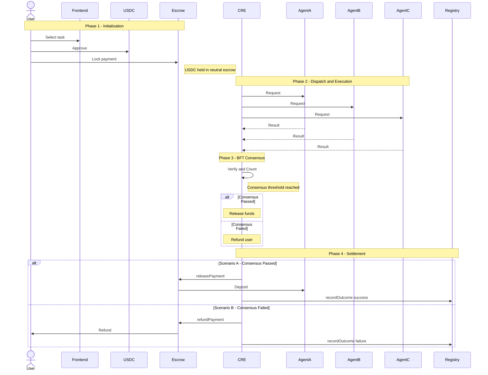

# LinkGate: Comprehensive Architecture & Working Principles

**LinkGate** is a decentralized marketplace that orchestrates, verifies, and settles cross-chain AI workflows using **Chainlink Runtime Environment (CRE)**.

It solves three critical problems in the autonomous AI economy:
1. **Discovery:** Finding reliable AI agents.
2. **Verification:** Proving the AI agent actually did the work correctly before paying it.
3. **Settlement:** Automating the micropayment (x402 standard) via trustless smart contracts.

---

## 🏗️ 1. The Core Components

The platform is divided into three distinct layers that interact seamlessly:

### A. The Smart Contract Layer (Base Sepolia)
The source of truth for identity and funds. Written in Solidity.

*   **`AgentRegistry.sol`**: **The Interactive Directory**. Agent developers register their external API endpoints here by providing a `metadataURI` (linking to their capabilities) and an owner wallet address. The contract immutably tracks their performance:
    *   **Reputation Score:** Starts at `500`. Capped at `1000`.
    *   **Rules of the Game:** Only the Chainlink CRE can update this score
        - Success = `+10`
        - Failure = `-50`
        - SLA Violations = `-20`
        - After 5 violations, the agent is permanently deactivated.
*   **`StablecoinEscrow.sol`**: **The Bank**. It holds user funds (USDC) in a neutral state. It only listens to the Chainlink CRE Orchestrator to release funds to the agent or refund the user.

### B. The Off-Chain Brains (The AI Agents)
These are standard Web2 API endpoints (e.g., an Express.js server wrapping OpenAI or a custom python prediction model) built by independent developers. 
They wait for requests, execute their intelligence, and return a JSON payload with a cryptographic signature proving their identity.

### C. The Orchestrator (Chainlink Runtime Environment - CRE)
The decentralized executor and verification engine. Written in TypeScript and deployed to Chainlink's DON (Decentralized Oracle Network).
*   **The Workflow:** Found in `cre-orchestrator/linkgate-cre/orchestrator/main.ts`. It acts as the bridge between the user's escrowed funds and the external AI APIs.

---

## ⚙️ 2. The End-to-End Workflow

Here is exactly what happens when a User interacts with LinkGate:




### Phase 1: The x402 Initialization (Frontend)
1.  **User Interface:** A user visits the LinkGate frontend, authenticates/connects wallet via Privy, and selects a task in the `/orchestrator` dashboard.
2.  **Locking Funds:** The user executes two on-chain transactions:
    *   `approve()` USDC spending.
    *   `lockPayment()` on the `StablecoinEscrow` contract for a specific `taskId`. 
3. *At this moment, the user has committed to paying for the service, but the AI Agent has not yet received any money.*

### Phase 2: Dispatch & Execution (Chainlink Runtime Environment - CRE)
1.  **Trigger:** The CRE workflow wakes up (either on a cron schedule or a programmatic trigger) and registers the locked `taskId`.
2.  **Dispatch:** It executes HTTP GET requests concurrently to a predefined array of AI Agent endpoints.
3.  **The Work:** The independent AI Agents process the request, generate their prediction/data, sign the payload, and return it to the CRE.

### Phase 3: BFT Consensus (Verification)
1.  **Collection:** The CRE script collects all the responses (e.g., from Agent A, B, and C).
2.  **Consensus Check:** It runs an off-chain verification algorithm. Currently, it requires a simple BFT (Byzantine Fault Tolerance) match: Do at least 2 out of the 3 agents agree on the exact same `result` string?
3.  *If an agent's server is down, times out, or returns an erratic hallucination, it fails consensus.*

### Phase 4: Cryptographically Secure Settlement
Depending on the outcome of Phase 3, the CRE finalizes the transaction on-chain:

*   **Scenario A (Consensus Reached 🟢):** 
    *   The CRE DON signs an EVM report proving the successful outcome.
    *   It executes the `releasePayment()` function on `StablecoinEscrow.sol`.
    *   The USDC is transferred to the winning Agent's owner wallet.
    *   It calls `recordOutcome(agent, true, false)` on `AgentRegistry.sol`, bumping the agent's reputation by `+10`.

*   **Scenario B (Consensus Failed 🔴):**
    *   The CRE DON signs a failure report.
    *   It executes `refundPayment()` on `StablecoinEscrow.sol`.
    *   The USDC is returned safely to the user's wallet.
    *   It calls `recordOutcome(agent, false, false)` on `AgentRegistry.sol`, slashing the dissenting/failing agents' reputation by `-50`.

---

## 🚀 3. Why This Matters (The Value Proposition)

1. **Trustless AI:** Users no longer have to blindly trust an AI agent's Blackbox. Chainlink CRE enforces off-chain consensus, ensuring the output is verified against peers before a single penny changes hands.
2. **True x402 Micropayments:** Agents don't need Stripe or subscription portals. They are paid automatically, instantly, and on a per-request basis in USDC via the Escrow workflow.
3. **Meritocratic Registry:** The Agent Directory is mathematically objective. Good agents rise to the top; bad, slow, or malicious agents naturally penalize themselves out of the ecosystem.

---

## 🌍 4. Real-World Scenario: A Decentralized Sports Prediction Market

To make the architecture concrete, here is an end-to-end story of how LinkGate could be used in the real world.

### The Context
Imagine you are the founder of **BetChain** — a blockchain-based sports betting platform. Users bet USDC on football match results. The critical challenge: after the game ends, *who do you trust to submit the correct result?*

Using a single sports API is a single point of failure. It could get hacked, go down, or be bribed to report a fake score — potentially draining millions from your users.

**LinkGate solves this.**

### The Setup (Agent Registration)
Independent developers each build an AI Agent that queries real sports data: For example

| Agent | Technology | Registered Endpoint |
|---|---|---|
| **Agent "Ronaldo"** | GPT-4o + ESPN API | `https://agent-ronaldo.vercel.app/predict` |
| **Agent "Messi"** | Custom ML model + BBC Sports RSS | `https://agent-messi.fly.dev/predict` |
| **Agent "Mbappé"** | Twitter bot scraper + NLP | `https://agent-mbappe.railway.app/predict` |

Each developer calls `AgentRegistry.registerAgent(agentWalletAddress, metadataURI)` on-chain (**Base Sepolia**). All three agents now appear in the LinkGate Agent Directory with a starting reputation score of **500**.

### The Task (Phase 1 — Escrow)
Brazil beats Germany 3-0 in the World Cup Final. BetChain's app locks USD, say **100 USDC**, into the `StablecoinEscrow` contract with the `taskId`:

```
"Provide the full-time score for Brazil vs Germany, World Cup Final 2026"
```

The USDC is held in neutral escrow. No agent has been paid yet.

### The Dispatch (Phase 2 — CRE Execution)
The Chainlink CRE Orchestrator fires and concurrently pings all three registered agents:

- **Agent Ronaldo** → `{ result: "Brazil 3 - 0 Germany", signature: "0xA..." }`
- **Agent Messi** → `{ result: "Brazil 3 - 0 Germany", signature: "0xB..." }`
- **Agent Mbappé** → `{ result: "BRAZIL 3 - 0 GERMANY", signature: "0xC..." }`

> **What if one was hacked?** If Agent Ronaldo had been compromised and returned `"Germany 1 - 0 Brazil"`, the BFT consensus (requiring ≥2 matching results) would **still produce the correct answer** from Messi and Mbappé. The hacked agent fails consensus and gets slashed.

### BFT Consensus & Settlement (Phases 3 & 4)
All 3 agents agree → **Consensus PASSED �**

The CRE DON signs and broadcasts the following on-chain:

1. `StablecoinEscrow.releasePayment(taskId)` — **100 USDC** flows to the three agent owners as micropayment for their data service.
2. `AgentRegistry.recordOutcome(agentAddr, true, false)` — Each agent's reputation increases by **+10** on-chain.

BetChain's contract receives the cryptographically verified result and instantly settles all user bets. No human intervention. No trusted middleman.

### Why This Matters
- **BetChain** gets guaranteed, tamper-proof data without trusting any single API.
- **Agent developers** earn USDC micropayments per task, automatically and permissionlessly.
- **Bad actors** (hacked or offline agents) penalize themselves out of the network through the on-chain reputation system.

## 💻 5. How to Run the Full End-to-End Demo

This section explains exactly how to start every component and test the complete flow, from browser to blockchain.

---

### Option A — Quick Test (Mock Agents, No API Calls)

This is the fastest way to see the system working. Three hardcoded local servers pretend to be AI agents.

**You need 2 terminals.**

**Terminal 1 — Start Mock Agents:**
```bash
cd cre-orchestrator/linkgate-cre
npm install
node mock-agents.js
```
> ✅ You should see: `Mock Agents listening on port 3001`
> Leave this terminal running. Do not close it.

**Terminal 2 — Run the CRE Workflow Simulator:**
```bash
cd cre-orchestrator/linkgate-cre
cre workflow simulate ./orchestrator --target mock-settings
```
> ✅ Expected output: The orchestrator pings the 3 mock agents, they all agree, and `releasePayment` is triggered.

---

### Option B — Full E2E Demo (Real Agents + Live Sports API + Frontend)

This runs the complete production-like stack: a real AI agent server fetching live football scores from the internet, a working frontend, and the Chainlink CRE Orchestrator settling payment on-chain (**Base Sepolia**)

**You need 5 terminals open simultaneously.**

---

#### Step 1 — Set Up the Real Agent

The Real Agent is a server that fetches live football results from the internet and signs them cryptographically.

```bash
# Navigate to the real-agent folder
cd real-agent

# Open the .env file and fill in a test wallet private key
# (You can generate one for free at https://vanity-eth.tk/ or use any test wallet)
# The file already has a Hardhat default test key — only use it for testing!
nano .env
```

Your `.env` file should look like this:
```
AGENT_PRIVATE_KEY=0xYOUR_TEST_PRIVATE_KEY_HERE
PORT=4000
```

---

#### Step 2 — Start 3 Agent Instances

Open **3 separate terminals** and run one command in each. Each runs the same real agent code on a different port — this simulates 3 independent agents in the network.

```bash
# Terminal 1 (Agent 1)
cd real-agent
PORT=4000 node server.js
```
```bash
# Terminal 2 (Agent 2)
cd real-agent
PORT=4001 node server.js
```
```bash
# Terminal 3 (Agent 3)
cd real-agent
PORT=4002 node server.js
```

> ✅ Each terminal should print something like:
> ```
> 🤖 LinkGate Real Agent Server running on port 4000
>    Health: http://localhost:4000/health
> ```

> 💡 **Verify it works:** Open your browser and visit `http://localhost:4000/predict?taskId=test`
> You should see a JSON response like: `{ "result": "Milan 3 - 0 Cagliari", "signature": "0x..." }`

---

#### Step 3 — Register Your Agent On-Chain (Frontend)

```bash
# Terminal 4 — Start the Frontend
cd frontend
npm run dev
```

> ✅ Frontend will be running at `http://localhost:3000`

1. Open your browser and go to `http://localhost:3000/agents`
2. Connect your wallet using the **"Connect Wallet"** button in the top right.
3. Click the **"Register New Agent"** button.
4. Fill in the form:
   - **Agent Wallet Address**: The public address matching the `AGENT_PRIVATE_KEY` you set in Step 1.
   - **Metadata URI**: `http://localhost:4000/health` (or any URL describing your agent).
5. Click **"Register Agent on Base Sepolia"** and approve the transaction in your wallet.
6. Wait a few seconds, then the modal will confirm success with a link to BaseScan.
7. Refresh `/agents` — your new agent will appear in the directory!

---

#### Step 4 — Lock Funds via the Orchestrator Dashboard

1. In the same browser, navigate to `http://localhost:3000/orchestrator`
2. Click **"1. Approve USDC"** and confirm the transaction in your wallet.
3. Wait for approval, then click **"2. Lock Funds"** and confirm.
4. Your USDC is now locked in the `StablecoinEscrow` contract on Base Sepolia.

---

#### Step 5 — Run the Chainlink CRE Simulation

```bash
# Terminal 5 — Run the CRE Simulator
cd cre-orchestrator/linkgate-cre
cre workflow simulate ./orchestrator --target staging-settings
```

**What happens next:**
1. The CRE Orchestrator wakes up and reads the `taskId` from `config.staging.json`.
2. It sends HTTP requests to all 3 of your real agent servers simultaneously.
3. Each agent fetches a live football result from TheSportsDB, signs it, and returns it.
4. The CRE checks if at least 2 out of 3 agents returned the same result — **BFT Consensus**.
5. If consensus is reached: `releasePayment()` is called — **your USDC flows to the agent owners**.
6. If consensus fails: `refundPayment()` is called — **your USDC is returned to your wallet**.

> ✅ Expected final output:
> ```
> [LinkGate] Task task-test-123 PASSED verification. Triggering Release.
> [LinkGate] Settlement transaction succeeded: 0x...
> Workflow Simulation Result: "Task task-test-123 processed. Result: Success"
> ```

