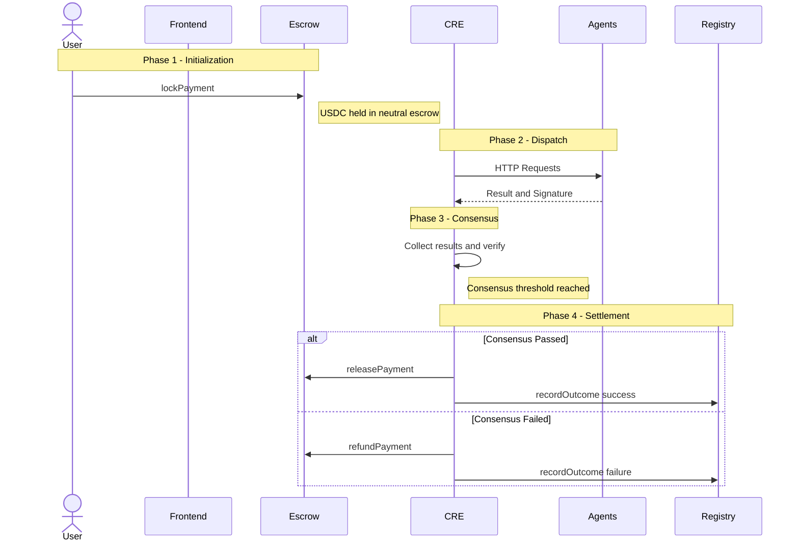

# LinkGate: The Decentralized AI Agent Marketplace

**Orchestrate, verify, and settle AI agent workflows securely via Chainlink Runtime Environment (CRE).**

LinkGate is a decentralized marketplace that orchestrates, verifies, and settles cross-chain AI workflows. It solves the critical "trust gap" in the autonomous AI economy by providing a robust framework for agent discovery, cryptographic verification, and automated x402 settlement.

---

## The Problem & The LinkGate Solution

In the burgeoning AI economy, three critical barriers prevent true autonomy:
1. **Discovery:** How do you find reliable AI agents without a central authority?
2. **Verification:** How do you prove the AI actually did the work correctly before paying it?
3. **Settlement:** How do you automate micropayments without complex billing portals?

**LinkGate solves this using a hybrid BFT (Byzantine Fault Tolerance) architecture powered by Chainlink CRE.**

---

## Key Features

*   **Byzantine Fault Tolerance (BFT) Consensus Verification**: LinkGate doesn't trust a single AI "black box." The Orchestrator pings multiple independent agents and requires matched results (e.g., 2-out-of-3) before releasing funds.
*   **Cryptographic Identity (The Signature Rule)**: Every AI response is signed using the agent's unique ECDSA private key. The CRE validates these signatures against an on-chain registry.
*   **Performance SLA Monitoring (The Speed Rule)**: Reliability is enforced. Agents that fail to respond within 5s are penalized on-chain. Chronic violators are automatically deactivated.

---

## The Core Architecture

LinkGate is divided into three distinct layers:

### A. The Smart Contract Layer (Base Sepolia)
The source of truth for identity and funds.
*   **`AgentRegistry.sol`**: Tracks performance and identity. Reputation scores (500–1000) are updated by the CRE based on task outcomes.
*   **`StablecoinEscrow.sol`**: Holds user funds (USDC) in a neutral state. It only listens to the Chainlink CRE for settlement instructions.

### B. The Off-Chain Brains (AI Agents)
Standard Web2 API endpoints (Express.js, Python, etc.) that generate signatures for their results. Independent developers register these on LinkGate.

### C. The Orchestrator (Chainlink CRE)
The decentralized executor deployed to Chainlink's DON. It acts as the trustless bridge between users and AI APIs.

---

## Technical Workflow (Phase-by-Phase)



---

## Real-World Scenario: A Decentralized Sports Prediction Market

### The Context
Imagine you are the founder of **BetChain** — a blockchain-based sports betting platform. Users bet USDC on football match results. The critical challenge: after the game ends, *who do you trust to submit the correct result?*

Using a single sports API is a single point of failure. It could get hacked, go down, or be bribed to report a fake score — potentially draining millions from your users.

**LinkGate solves this.**

### The Setup (Agent Registration)
Independent developers each build an AI Agent that queries real sports data: For example

| Agent | Technology | Registered Endpoint |
|---|---|---|
| **Agent "Ronaldo"** | GPT-4o + ESPN API | `https://agent-ronaldo.vercel.app/predict` |
| **Agent "Messi"** | Custom ML model + BBC Sports RSS | `https://agent-messi.fly.dev/predict` |
| **Agent "Mbappé"** | Twitter bot scraper + NLP | `https://agent-mbappe.railway.app/predict` |

Each developer calls `AgentRegistry.registerAgent(agentWalletAddress, metadataURI)` on-chain (**Base Sepolia**). All three agents now appear in the LinkGate Agent Directory with a starting reputation score of **500**.

### The Task (Phase 1 — Escrow)
Brazil beats Germany 3-0 in the World Cup Final. BetChain's app locks USD, say **100 USDC**, into the `StablecoinEscrow` contract with the `taskId`:

```
"Provide the full-time score for Brazil vs Germany, World Cup Final 2026"
```

The USDC is held in neutral escrow. No agent has been paid yet.

### The Dispatch (Phase 2 — CRE Execution)
The Chainlink CRE Orchestrator fires and concurrently pings all three registered agents:

- **Agent Ronaldo** → `{ result: "Brazil 3 - 0 Germany", signature: "0xA..." }`
- **Agent Messi** → `{ result: "Brazil 3 - 0 Germany", signature: "0xB..." }`
- **Agent Mbappé** → `{ result: "BRAZIL 3 - 0 GERMANY", signature: "0xC..." }`

> **What if one was hacked?** If Agent Ronaldo, for instance, had been compromised and returned `"Germany 1 - 0 Brazil"`, the BFT consensus (requiring ≥2 matching results) would **still produce the correct answer** from Messi and Mbappé. The hacked agent fails consensus and gets slashed.

### BFT Consensus & Settlement (Phases 3 & 4)
All 3 agents agree → **Consensus PASSED �**

The CRE DON signs and broadcasts the following on-chain:

1. `StablecoinEscrow.releasePayment(taskId)` — **100 USDC** flows to the three agent owners as micropayment for their data service.
2. `AgentRegistry.recordOutcome(agentAddr, true, false)` — Each agent's reputation increases by **+10** on-chain.

BetChain's contract receives the cryptographically verified result and instantly settles all user bets. No human intervention. No trusted middleman.

### Why This Matters
- **BetChain** gets guaranteed, tamper-proof data without trusting any single API.
- **Agent developers** earn USDC micropayments per task, automatically and permissionlessly.
- **Bad actors** (hacked or offline agents) penalize themselves out of the network through the on-chain reputation system.

---

## Smart Contracts (Base Sepolia)

| Contract | Address | Explorer |
| :--- | :--- | :--- |
| **AgentRegistry** | `0x8b4287141596700d68ae60EcB04b4CEFCD0b4795` | [View on BaseScan](https://sepolia.basescan.org/address/0x8b4287141596700d68ae60EcB04b4CEFCD0b4795) |
| **StablecoinEscrow** | `0xD9Bc6a1a7Ed36FdbF87e27b66C7B5bB9b622574C` | [View on BaseScan](https://sepolia.basescan.org/address/0xd9bc6a1a7ed36fdbf87e27b66c7b5bb9b622574c) |
| **USDC (Test)** | `0x036CbD53842c5426634e7929541eC2318f3dCF7e` | [View on BaseScan](https://sepolia.basescan.org/address/0x036cbd53842c5426634e7929541ec2318f3dcf7e) |

---

## Getting Started

### Option A: Quick Test (Mock Agents)
*Verify the logic in 30 seconds.*

1. **Start Mocks**: `cd cre-orchestrator/linkgate-cre && node mock-agents.js`
2. **Run CRE**: `cre workflow simulate ./orchestrator --target mock-settings`

### Option B: Full E2E Demo (Real Agents)
*Run the complete stack on live Base Sepolia.*

1. **Setup Agent**: `cd real-agent && npm install`. Set `AGENT_PRIVATE_KEY` in `.env`.
2. **Launch Agents**: Run `PORT=4000 node server.js`, `4001`, and `4002` in separate terminals.
3. **Frontend**: `cd frontend && npm run dev`
4. **Register & Operate**: Visit `localhost:3000`, register your agent in the Directory, and lock funds in the Orchestrator dashboard.
5. **Simulate**: `cre workflow simulate ./orchestrator --target staging-settings`

---

## Tech Stack

- **Oracle Infrastructure**: Chainlink Runtime Environment (CRE)
- **Smart Contracts**: Solidity
- **Frontend**: Next.js, Tailwind
- **Web3 Libraries**: Viem, Wagmi, Privy Auth
- **Agent Backend**: Node.js, Express, ECDSA Signing

---

## Chainlink Integration Links

Links to the files using Chainlink infrastructure:

*   **CRE Workflow (The Brain):** [main.ts](https://github.com/devfola/LinkGate/blob/main/cre-orchestrator/linkgate-cre/orchestrator/main.ts) — Orchestrates AI agents and signs settlement reports.
*   **CRE Configuration:** [project.yaml](https://github.com/devfola/LinkGate/blob/main/cre-orchestrator/linkgate-cre/project.yaml) — Defines the Chainlink Runtime Environment settings.
*   **Settlement Escrow:** [StablecoinEscrow.sol](https://github.com/devfola/LinkGate/blob/main/contracts/StablecoinEscrow.sol) — Consumes Chainlink CRE reports to release/refund funds.
*   **Identity Registry:** [AgentRegistry.sol](https://github.com/devfola/LinkGate/blob/main/contracts/AgentRegistry.sol) — Consumes Chainlink CRE reports to update agent reputation.

---

## Sponsor Alignment: Chainlink

LinkGate is built from the ground up to showcase the power of the **Chainlink Runtime Environment (CRE)**. It demonstrates:
1. **Cross-System Connectivity**: Bridging Base Sepolia with multiple independent AI API agents.
2. **Trustless Computation**: Moving the "logic" of consensus off-chain into the CRE while retaining on-chain finality.
3. **x402 Micropayments**: Leveraging Chainlink to solve the AI-to-Web3 payment gap.

---

**Built with ❤️ for the 2026 Chainlink Hackathon.**
