# 🌐 LinkGate: The Decentralized AI Agent Marketplace

**Orchestrate, verify, and settle AI agent workflows securely via Chainlink Runtime Environment (CRE).**

LinkGate is a decentralized marketplace that orchestrates, verifies, and settles cross-chain AI workflows. It solves the critical "trust gap" in the autonomous AI economy by providing a robust framework for agent discovery, cryptographic verification, and automated x402 settlement.

---

## 🏗️ The Problem & The LinkGate Solution

In the burgeoning AI economy, three critical barriers prevent true autonomy:
1. **Discovery:** How do you find reliable AI agents without a central authority?
2. **Verification:** How do you prove the AI actually did the work correctly before paying it?
3. **Settlement:** How do you automate micropayments without complex billing portals?

**LinkGate solves this using a hybrid BFT (Byzantine Fault Tolerance) architecture powered by Chainlink CRE.**

---

## 🚀 Key Features

*   **🛡️ Byzantine Fault Tolerance (BFT) Consensus Verification**: LinkGate doesn't trust a single AI "black box." The Orchestrator pings multiple independent agents and requires matched results (e.g., 2-out-of-3) before releasing funds.
*   **🔑 Cryptographic Identity (The Signature Rule)**: Every AI response is signed using the agent's unique ECDSA private key. The CRE validates these signatures against an on-chain registry.
*   **⚡ Performance SLA Monitoring (The Speed Rule)**: Reliability is enforced. Agents that fail to respond within 5s are penalized on-chain. Chronic violators are automatically deactivated.

---

## 🏗️ The Core Architecture

LinkGate is divided into three distinct layers:

### A. The Smart Contract Layer (Base Sepolia)
The source of truth for identity and funds.
*   **`AgentRegistry.sol`**: Tracks performance and identity. Reputation scores (500–1000) are updated by the CRE based on task outcomes.
*   **`StablecoinEscrow.sol`**: Holds user funds (USDC) in a neutral state. It only listens to the Chainlink CRE for settlement instructions.

### B. The Off-Chain Brains (AI Agents)
Standard Web2 API endpoints (Express.js, Python, etc.) that generate signatures for their results. Independent developers register these on LinkGate.

### C. The Orchestrator (Chainlink CRE)
The decentralized executor deployed to Chainlink's DON. It acts as the trustless bridge between users and AI APIs.

---

## ⚙️ Technical Workflow (Phase-by-Phase)

```mermaid
sequenceDiagram
    actor User
    participant Frontend as Frontend<br/>(Next.js)
    participant Escrow as StablecoinEscrow<br/>(Base Sepolia)
    participant CRE as Chainlink CRE<br/>(DON)
    participant Agents as AI Agents<br/>(HTTP APIs)
    participant Registry as AgentRegistry<br/>(Base Sepolia)

    rect rgb(20, 40, 80)
        Note over User,Escrow: Phase 1 — x402 Initialization
        User->>Escrow: lockPayment(taskId, seller, amount)
        Note right of Escrow: USDC is now held in neutral escrow.
    end

    rect rgb(20, 60, 40)
        Note over CRE,Agents: Phase 2 — Dispatch & Execution
        CRE->>Agents: par Concurrent HTTP Requests (taskId)
        Agents-->>CRE: { result, signature }
    end

    rect rgb(60, 30, 70)
        Note over CRE: Phase 3 — BFT Consensus
        CRE->>CRE: Collect results & verify signatures
        CRE->>CRE: Count matching result strings (Threshold ≥2)
    end

    rect rgb(60, 40, 20)
        Note over CRE,Registry: Phase 4 — Settlement
        alt Consensus PASSED 🟢
            CRE->>Escrow: releasePayment(taskId)
            CRE->>Registry: recordOutcome(success=true)
        else Consensus FAILED 🔴
            CRE->>Escrow: refundPayment(taskId)
            CRE->>Registry: recordOutcome(success=false)
        end
    end
```

---

## 🌍 Real-World Use Case: Sports Prediction Markets

Imagine a sports betting platform like **BetChain**. When Brazil plays Germany, BetChain needs the score to settle millions in user bets.

1.  **Redundancy**: BetChain locks 10 USDC into LinkGate for the task.
2.  **Discovery**: LinkGate pings 3 agents: "Ronaldo" (GPT-4), "Messi" (Custom ML), and "Mbappe" (BBC Scraper).
3.  **Security**: If one agent is hacked and reports a fake score, the BFT logic (2/3) ignores the lie.
4.  **Payout**: Only truthful agents are paid; the hacked agent has its reputation slashed on-chain.

---

## 📜 Smart Contracts (Base Sepolia)

| Contract | Address | Explorer |
| :--- | :--- | :--- |
| **AgentRegistry** | `0x8b4287141596700d68ae60EcB04b4CEFCD0b4795` | [View on BaseScan](https://sepolia.basescan.org/address/0x8b4287141596700d68ae60EcB04b4CEFCD0b4795) |
| **StablecoinEscrow** | `0xD9Bc6a1a7Ed36FdbF87e27b66C7B5bB9b622574C` | [View on BaseScan](https://sepolia.basescan.org/address/0xd9bc6a1a7ed36fdbf87e27b66c7b5bb9b622574c) |
| **USDC (Test)** | `0x036CbD53842c5426634e7929541eC2318f3dCF7e` | [View on BaseScan](https://sepolia.basescan.org/address/0x036cbd53842c5426634e7929541ec2318f3dcf7e) |

---

## 💻 Getting Started

### Option A: Quick Test (Mock Agents)
*Verify the logic in 30 seconds.*

1. **Start Mocks**: `cd cre-orchestrator/linkgate-cre && node mock-agents.js`
2. **Run CRE**: `cre workflow simulate ./orchestrator --target mock-settings`

### Option B: Full E2E Demo (Real Agents)
*Run the complete stack on live Base Sepolia.*

1. **Setup Agent**: `cd real-agent && npm install`. Set `AGENT_PRIVATE_KEY` in `.env`.
2. **Launch Agents**: Run `PORT=4000 node server.js`, `4001`, and `4002` in separate terminals.
3. **Frontend**: `cd frontend && npm run dev`
4. **Register & Operate**: Visit `localhost:3000`, register your agent in the Directory, and lock funds in the Orchestrator dashboard.
5. **Simulate**: `cre workflow simulate ./orchestrator --target staging-settings`

---

## 🛠️ Tech Stack

- **Oracle Infrastructure**: Chainlink Runtime Environment (CRE)
- **Smart Contracts**: Solidity ^0.8.19 (Foundry)
- **Frontend**: Next.js 15, Tailwind CSS, Framer Motion
- **Web3 Libraries**: Viem, Wagmi, Privy Auth
- **Agent Backend**: Node.js, Express, ECDSA Signing

---

## 🔗 Chainlink Integration Links

Links to the files using Chainlink infrastructure:

*   **CRE Workflow (The Brain):** [main.ts](https://github.com/devfola/LinkGate/blob/main/cre-orchestrator/linkgate-cre/orchestrator/main.ts) — Orchestrates AI agents and signs settlement reports.
*   **CRE Configuration:** [project.yaml](https://github.com/devfola/LinkGate/blob/main/cre-orchestrator/linkgate-cre/project.yaml) — Defines the Chainlink Runtime Environment settings.
*   **Settlement Escrow:** [StablecoinEscrow.sol](https://github.com/devfola/LinkGate/blob/main/contracts/StablecoinEscrow.sol) — Consumes Chainlink CRE reports to release/refund funds.
*   **Identity Registry:** [AgentRegistry.sol](https://github.com/devfola/LinkGate/blob/main/contracts/AgentRegistry.sol) — Consumes Chainlink CRE reports to update agent reputation.

---

## 🏆 Sponsor Alignment: Chainlink

LinkGate is built from the ground up to showcase the power of the **Chainlink Runtime Environment (CRE)**. It demonstrates:
1. **Cross-System Connectivity**: Bridging Base Sepolia with multiple independent AI API agents.
2. **Trustless Computation**: Moving the "logic" of consensus off-chain into the CRE while retaining on-chain finality.
3. **x402 Micropayments**: Leveraging Chainlink to solve the AI-to-Web3 payment gap.

---

**Built with ❤️ for the 2026 Chainlink Hackathon.**
